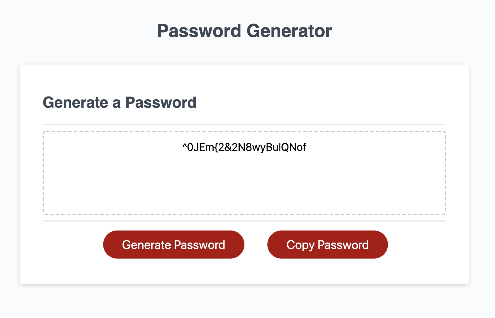

# Password Generator

This is an application that generates a random password based on user-selected criteria.

The app runs in the browser and features dynamically updated HTML and CSS powered by Javascript.

>Technologies: HTML, CSS 

## What's Included:
1. User is presented with a series of prompts for password criteria
2. User selects length of password (between 8 - 128 characters)
3. User can choose from lowercase, uppercase, numeric, and/or special characters
4. Once all prompts are answered the password is generated and displayed
5. User can copy the password to clipboard


##  Application Image:
#



## How it generates a password:
#

The password is generated using  a nested array. 
The array validChar holds character-type arrays:

```
validChar = [
    ["a","b","c",...], 
    ["A","B","C",...], 
    [0,1,2,..], 
    ["?","@","!",...]]
```
 
The validChar array will only have the arrays of characters that the user has requested. Two functions are used to find the character index at random:

- generateRandomType() - a number is randomly generated that represents the index of one of these valid arrays (ex. index between 0-3).
- generateRandomChar() - a number is randomly generated for the index of that type (ex. index between 0-25). 

```
// Generates the type of digit - "lowerCase"
function generateRandomType() {
  // Generate a number between 0 and validChar length
  return Math.floor(Math.random() * validChar.length);
}


// Generates the char in type array - "k"
function generateRandomChar(typeIdx) {
  // Generate a number between 0 and typeIdx array length
  return Math.floor(Math.random() * validChar[typeIdx].length);
}
```

This is done for each letter generated in the password such that all character type options the user requested are available but not necessaily guaranteed.

### Author
#
Nadine Bundschuh

[LinkedIn](https://www.linkedin.com/in/nadine-bundschuh-731233b9)
|
[GitHub](https://github.com/nadineb1160)

